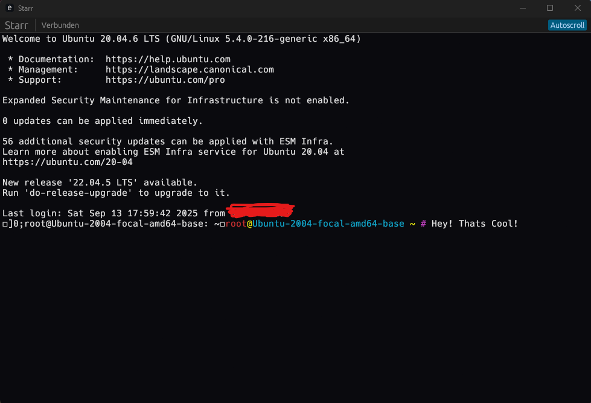
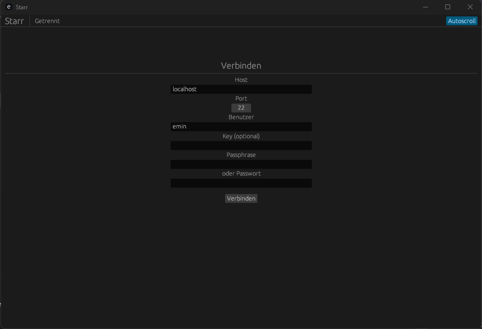
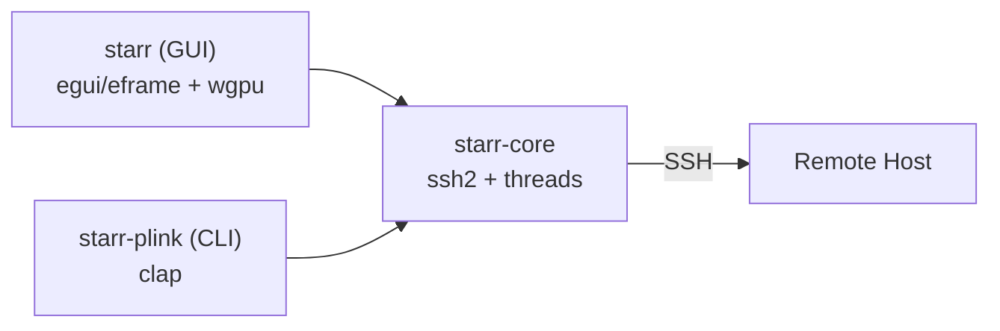
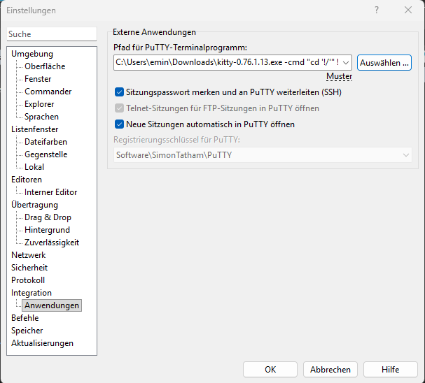

# Starr

> Warning — Early Alpha
>
> - WinSCP integration (`starr-plink`) is experimental/partial. Do not rely on it for production.
> - GUI "Send" functionality is incomplete and under active development.
> - Expect bugs, missing features, and breaking changes.

Modern, fast SSH client and PuTTY alternative with first-class WinSCP compatibility. Starr ships as a Rust workspace with a GUI app and a lightweight `starr-plink` CLI that you can use as a drop-in replacement for PuTTY in WinSCP.


[](https://github.com/EministarVR/starr/actions/workflows/ci.yml)

> Note: This README embeds diagrams, tables, and screenshots. Put your images under `docs/screenshots/` and adjust the filenames.

## Screenshots

> Place your screenshots under `docs/screenshots/` and adjust the paths below.

| Connect View | Terminal View |
| --- | --- |
|  |  |

## Feature Highlights

| Area | Highlights | Status |
| --- | --- | --- |
| GUI (eframe/egui) | Dark UI, auto-copy on selection, middle/right-click paste & send, autoscroll toggle, basic ANSI color rendering | MVP |
| Core (ssh2) | SSH session, PTY, shell, send/resize, buffered reads, thread-safe handles | Stable MVP |
| CLI (`starr-plink`) | WinSCP-compatible flags, `user@host`, password and key support, minimal error surface | MVP |
| Windows focus | No extra console, clipboard integration | Supported |

## How It Works



### Modules

- `starr-core`: SSH session management built on `ssh2`. Opens PTY + shell, spawns a reader thread, exposes `send`, `resize`, `read_string` and safe close.
- `starr` (GUI): Egui/eframe app with a connect form and a terminal-like view. Auto-copy on selection (PuTTY-style), paste & send, optional local echo, throttled ANSI layout to reduce GPU load.
- `starr-plink`: Minimal CLI compatible with WinSCP's PuTTY integration. Accepts familiar flags like `-P`, `-l`, `-i`, `-pw`, `--pass` and tolerates unknown plink flags.

## Getting Started

### Prerequisites

- [Rust](https://www.rust-lang.org/tools/install) (stable)
- Windows 10/11 recommended (other OSes may work but are untested)
- Recent GPU drivers (GUI uses `wgpu` via eframe)

### Build

```sh
git clone https://github.com/EministarVR/starr.git
cd starr
cargo build --release
```

Artifacts (Windows): `target/release/starr.exe`, `target/release/starr-plink.exe`.

### Run

- GUI:
  ```sh
  cargo run -p starr --release
  ```
- CLI (plink-style):
  ```sh
  cargo run -p starr-plink -- --help
  cargo run -p starr-plink -- -P 22 -l user host -pw secret
  cargo run -p starr-plink -- user@host -i C:\\Keys\\id_ed25519 --pass myPassphrase
  ```

## WinSCP Integration

Use `starr-plink.exe` as the PuTTY/Plink path in WinSCP:

1. Build release binaries: `cargo build -p starr-plink --release`.
2. In WinSCP, set Preferences > Integration > Applications > "PuTTY/Plink path" to your `starr-plink.exe`.
3. Connect as usual; WinSCP will invoke `starr-plink` with plink-compatible flags.

> Optional screenshot: 

## Project Structure

```
crates/
  core/   # Core library (ssh2)
  gui/    # GUI app (eframe/egui)
  plink/  # Plink-compatible CLI for WinSCP
```

## Keyboard & Mouse

| Action | Behavior |
| --- | --- |
| Select text | Copies selection to clipboard (PuTTY-style) |
| Right/Middle click | Paste from clipboard and send |
| Ctrl+V | Paste from clipboard and send |
| Autoscroll toggle | Keeps view anchored to bottom when enabled |

## Troubleshooting

- High GPU usage: the GUI throttles redraws (~50 ms) to reduce GPU load. Update GPU drivers if usage is still high.
- Authentication: supports OpenSSH keys (passphrase optional) or password. PPK conversion required for now.
- Console window: Windows build runs without an extra console window.

## Roadmap

- [ ] Expand terminal emulation and ANSI handling
- [ ] Performance tuning and GPU footprint reduction
- [ ] Harden error handling and reconnection logic
- [ ] Cross-platform testing (Linux/macOS)

## Contributing

Contributions are welcome! Please open issues or pull requests to help improve the project.

## License

MIT License. See `LICENSE` (or package metadata) for details.

---

> Warning: This software is in active development. Use at your own risk.
